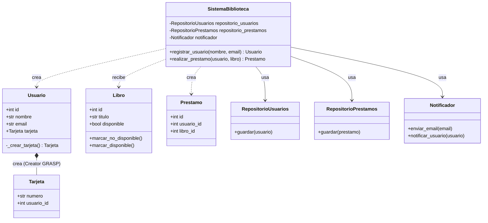

# Sistema de Biblioteca — Código Refactorizado

## Descripción

Este proyecto demuestra la refactorización de un sistema de biblioteca aplicando los principios **GRASP (Creator)** y **SOLID (Single Responsibility Principle — SRP)**.

- **Antes:** La clase `SistemaBiblioteca` concentraba múltiples responsabilidades: creación de objetos, persistencia, notificaciones y lógica de negocio.
- **Después:** Cada clase tiene una única responsabilidad, y cada objeto es creado por quien lo contiene o agrega.

---

## Estructura del proyecto

```
📁 Reto G4/
├── main.py                          # Punto de entrada — ejecuta el código refactorizado
├── RetoTecnico.py                   # Código original problemático (referencia)
├── README.md
├── 📁 diagramas/
│   ├── diagrama_antes.html          # Diagrama del diseño original
│   ├── diagrama_despues.html        # Diagrama del diseño refactorizado
│   └── presentacion.html            # Presentación del reto técnico
└── 📁 refactorizado/
    ├── __init__.py
    ├── sistema_biblioteca.py        # Orquestador principal
    ├── 📁 modelos/
    │   ├── __init__.py
    │   ├── libro.py                 # Modelo Libro
    │   ├── prestamo.py              # Modelo Prestamo
    │   ├── tarjeta.py               # Modelo Tarjeta
    │   └── usuario.py               # Modelo Usuario (crea Tarjeta — Creator)
    └── 📁 servicios/
        ├── __init__.py
        ├── notificador.py           # Servicio de notificaciones (SRP)
        ├── repositorio_prestamos.py # Persistencia de préstamos (SRP)
        └── repositorio_usuarios.py  # Persistencia de usuarios (SRP)
```

---

## Diagrama UML de clases



---

## Principios aplicados

### GRASP — Creator

> *"Asignar la responsabilidad de crear una instancia de A a la clase B si B contiene o agrega objetos de A."*

| Objeto creado | ¿Quién lo crea? | Justificación |
|---|---|---|
| `Tarjeta` | `Usuario` | `Usuario` contiene y agrega a `Tarjeta` |
| `Prestamo` | `SistemaBiblioteca` | Orquesta la relación entre `Usuario` y `Libro` |

### SOLID — Single Responsibility Principle (SRP)

> *"Una clase debe tener una, y solo una, razón para cambiar."*

| Clase | Responsabilidad única |
|---|---|
| `SistemaBiblioteca` | Orquestar operaciones de negocio |
| `Usuario` | Representar un usuario y crear su tarjeta |
| `Libro` | Gestionar su propia disponibilidad |
| `Tarjeta` | Representar una tarjeta de biblioteca |
| `Prestamo` | Representar un préstamo |
| `RepositorioUsuarios` | Persistencia de usuarios |
| `RepositorioPrestamos` | Persistencia de préstamos |
| `Notificador` | Envío de notificaciones |

---

## Ejecución

```bash
python main.py
```

Salida esperada:

```
EJECUTANDO código refactorizado...
------------------------------------------------------------
Guardando usuario y tarjeta en BD...
Enviando email a juan@email.com
Notificando a Juan
Guardando préstamo en BD...

Ahora cada clase tiene UNA sola responsabilidad (SRP)
Y cada objeto es creado por quien lo contiene (Creator)
```
